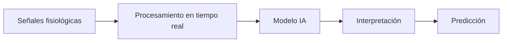
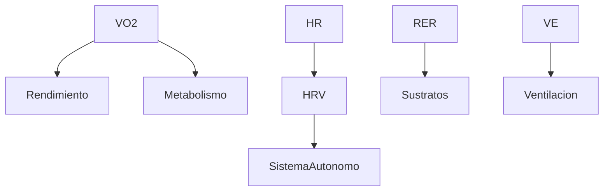
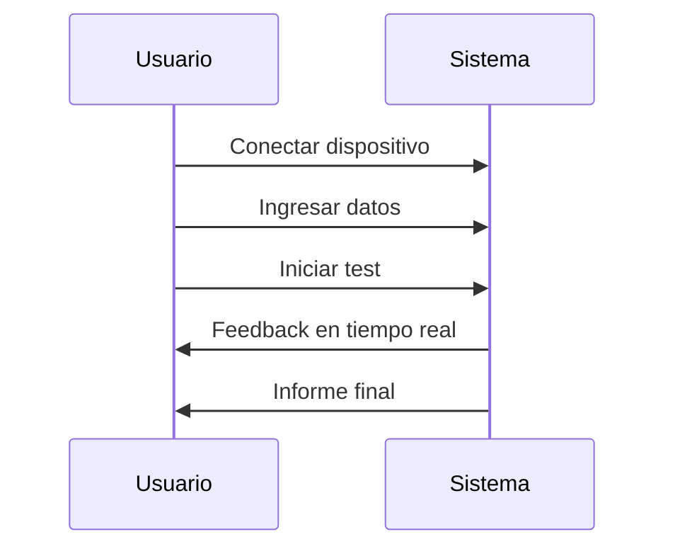
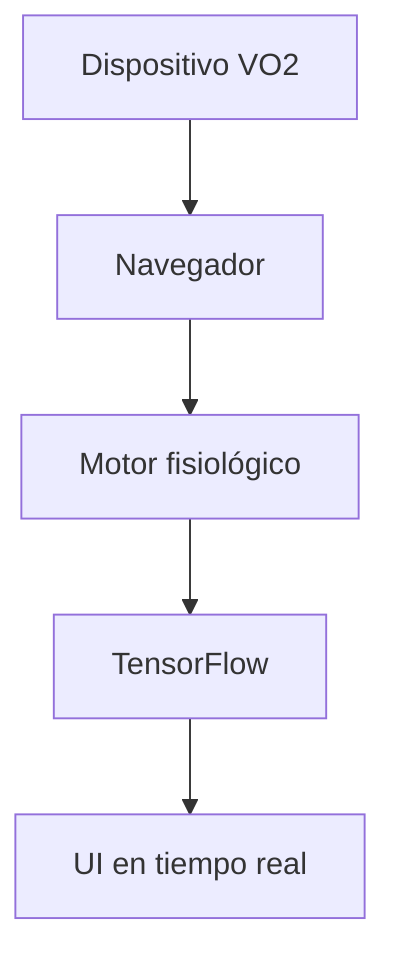

# 🧠 VO₂Smart PRO v5

### Inteligencia clínica portátil para medir, entender y predecir el rendimiento humano

  <b>De laboratorio especializado → a cualquier lugar</b> 
  Evaluación cardiopulmonar con inteligencia artificial integrada

  
  
  

---

## ✨ Una nueva categoría

**VO₂Smart no compite con los sistemas tradicionales.**
Los reemplaza.

> La ergoespirometría deja de ser un procedimiento de laboratorio
> y se convierte en una **herramienta universal, portátil e inteligente**

---

## 🌍 El problema

Hoy medir VO₂ implica:

* Infraestructura costosa
* Equipamiento complejo
* Personal altamente especializado
* Acceso limitado

👉 **La mayoría de las personas nunca es evaluada**

---

## 🚀 La solución

VO₂Smart convierte esto en:

* Un test simple (ej: escalón 6 minutos)
* Un dispositivo portátil
* Una plataforma web inteligente
* Un sistema escalable vía telemedicina

👉 **Acceso masivo, sin perder valor clínico**

---

## 🧠 Inteligencia que interpreta

Construido sobre
TensorFlow

VO₂Smart no solo mide:

---

### Lo que hace diferente

* Detecta patrones invisibles al ojo humano
* Reduce ruido en condiciones reales
* Aprende del paciente
* Entrega decisiones, no solo datos

---

## ⚡ Edge AI

* Procesamiento local
* Sin nube obligatoria
* Latencia mínima
* Privacidad total

👉 Diseñado para salud real, no solo laboratorio

---

## 🫁 Señales que importan

* VO₂ / VCO₂
* RER
* Ventilación (VE)
* Frecuencia cardíaca
* HRV (estado autonómico)

---

## 📊 Experiencia visual

* Visualización en tiempo real
* Radar fisiológico
* Comparación longitudinal
* Informe automático

---

## 🧪 Uso en segundos

---

## ♿ Diseñado para todos

* Niños
* Adultos mayores
* Pacientes crónicos
* Personas con discapacidad
* Deportistas paralímpicos

👉 Inclusión como estándar, no como excepción

---

## 📡 Arquitectura

* 100% web
* Sin backend obligatorio
* Compatible con BLE y USB

---

## 🌐 Telemedicina real

* Evaluación remota
* Escalable a redes de salud
* Datos compartibles
* Monitoreo continuo

---

## 📈 Impacto

| Dimensión  | Resultado            |
| ---------- | -------------------- |
| Salud      | Diagnóstico temprano |
| Acceso     | Evaluación masiva    |
| Costos     | Reducción radical    |
| Tecnología | IA aplicada real     |

---

## 🧠 Diferencia fundamental

| Antes        | Ahora            |
| ------------ | ---------------- |
| Medir        | Medir + entender |
| Laboratorio  | Cualquier lugar  |
| Especialista | Escalable        |
| Datos        | Decisiones       |

---

## 🔮 Futuro

* IA predictiva clínica
* Modelos federados
* Integración con wearables
* Certificación FDA / CE

---

## 📜 Licencia

MIT

---

## 👨‍🔬 Autor

**ActionSmart® – Claudio Abarca Vargas**
🇨🇱 Chile
Patente: CL 2024024875

---

## 🧠 Declaración final

> **No es un dispositivo deportivo - médico más.**
> Es la transición desde evaluación limitada…
> hacia inteligencia fisiológica accesible para todos.

