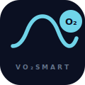
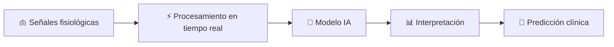
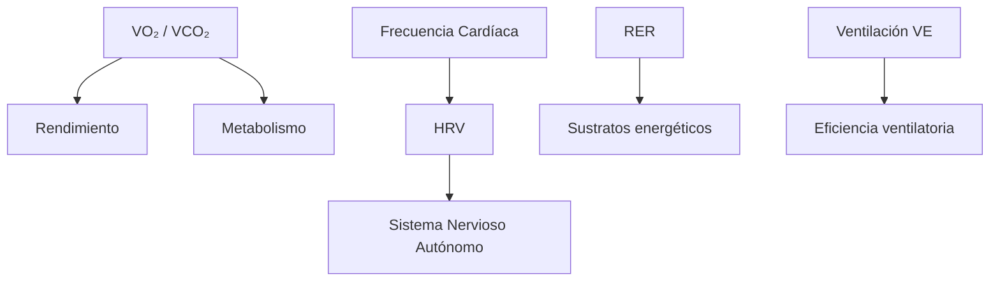
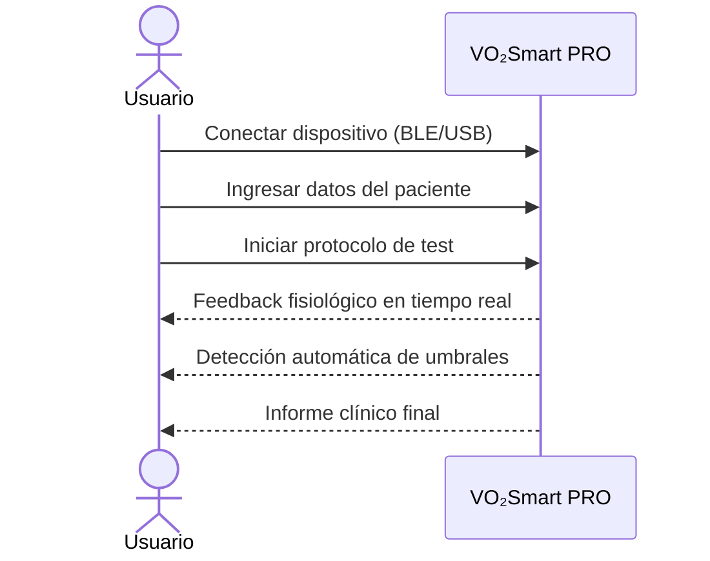
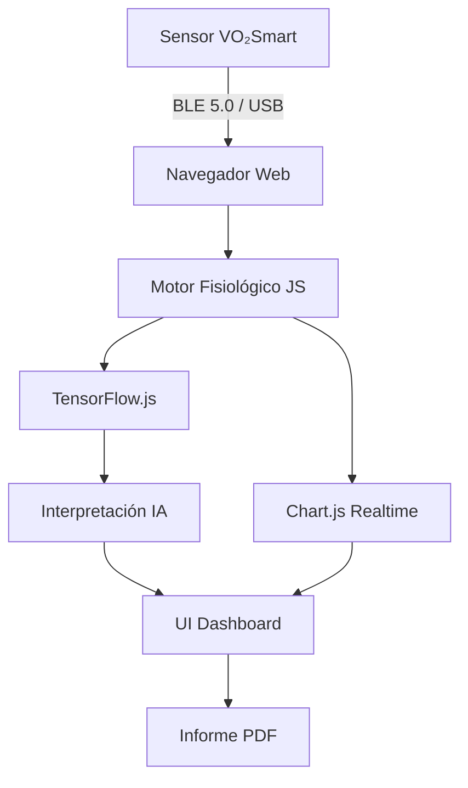

<div align="center">



# VO₂Smart PRO v5

**Inteligencia clínica portátil para medir, entender y predecir el rendimiento humano**

[](LICENSE)
[](#)
[](#)
[](#)
[](#)
[](#)

[🌐 **Ver Demo en Vivo**](https://csav20.github.io/Vo2Smart-Interfaz/) · [📱 **Abrir App**](https://csav20.github.io/Vo2Smart-Interfaz/app.html) · [📄 **Documentación**](#arquitectura)

---

*De laboratorio especializado → a cualquier lugar*

</div>

---

## ✨ Una nueva categoría

**VO₂Smart no compite con los sistemas tradicionales. Los reemplaza.**

La ergoespirometría deja de ser un procedimiento de laboratorio y se convierte en una **herramienta universal, portátil e inteligente** — accesible desde cualquier navegador, en cualquier dispositivo, para cualquier persona.

---

## 🌍 El problema

Hoy medir el VO₂ máximo —el indicador más poderoso de salud cardiorrespiratoria— requiere:

| Barrera | Impacto |
|---|---|
| 🏥 Infraestructura costosa | Solo hospitales y laboratorios especializados |
| 🔬 Equipamiento complejo | Miles de dólares por dispositivo |
| 👨‍⚕️ Personal altamente especializado | Semanas de agenda |
| 🌎 Distribución geográfica limitada | Solo ciudades grandes |

> **La mayoría de las personas nunca es evaluada.** Eso cambia ahora.

---

## 🚀 La solución

VO₂Smart convierte la ergoespirometría clínica en:

- **Un test simple** (ej: escalón 6 minutos, protocolo Ramp, Bruce, o libre)
- **Un dispositivo portátil** (sensor BLE o USB)
- **Una plataforma web inteligente** (sin instalación)
- **Un sistema escalable** vía telemedicina

> Acceso masivo, **sin perder valor clínico**.

---

## 🧠 Inteligencia que interpreta

Construido sobre **TensorFlow.js** con procesamiento **Edge AI**, VO₂Smart no solo mide: **interpreta**.



### Lo que hace diferente

| Otros sistemas | VO₂Smart |
|---|---|
| Medir | Medir **+ entender** |
| Laboratorio | **Cualquier lugar** |
| Especialista requerido | **Escalable** |
| Datos crudos | **Decisiones clínicas** |

### ⚡ Edge AI — Procesamiento sin nube

- ✅ Procesamiento **100% local** en el navegador
- ✅ Sin servidor obligatorio
- ✅ Latencia mínima (&lt;50ms)
- ✅ **Privacidad total** — los datos no salen del dispositivo

---

## 🫁 Señales que importan



| Señal | Qué revela |
|---|---|
| **VO₂ / VCO₂** | Consumo de oxígeno y producción de CO₂ |
| **RER** | Proporción de sustratos (grasa vs. carbohidratos) |
| **VE** | Eficiencia ventilatoria, umbral ventilatorio |
| **FC** | Respuesta cardiovascular, umbral anaeróbico |
| **HRV** | Estado del sistema nervioso autónomo |

---

## 📊 Experiencia visual

- 📈 Visualización en tiempo real (Chart.js)
- 🕸️ Radar fisiológico multiparámetro
- 📅 Comparación longitudinal entre sesiones
- 📄 Informe clínico automático exportable

---

## 🧪 Uso en segundos



---

## ♿ Diseñado para todos

VO₂Smart es el primer sistema de ergoespirometría **universalmente accesible**:

- 👶 Niños (protocolos pediátricos adaptados)
- 👴 Adultos mayores
- 🏥 Pacientes con patologías crónicas (EPOC, IC, DM)
- ♿ Personas con discapacidad
- 🏅 Deportistas paralímpicos

> **Inclusión como estándar, no como excepción.**

---

## 📡 Arquitectura



| Capa | Tecnología |
|---|---|
| **Frontend** | HTML5 · CSS3 · JavaScript ES2024 |
| **Visualización** | Chart.js 4.4 · SVG custom |
| **IA / ML** | TensorFlow.js (Edge AI) |
| **Conectividad** | Web Bluetooth API · Web Serial API |
| **i18n** | ES · EN · PT (nativo) |

---

## 🌐 Telemedicina real

- 📡 Evaluación cardiopulmonar remota
- 🏥 Escalable a redes hospitalarias y de APS
- 📊 Datos compartibles con profesionales
- 📱 Compatible con cualquier dispositivo moderno

---

## 📈 Impacto esperado

| Dimensión | Antes | Con VO₂Smart |
|---|---|---|
| **Salud poblacional** | Diagnóstico tardío | Detección temprana masiva |
| **Acceso** | <1% de la población | Universal |
| **Costo por evaluación** | $300–$1,500 USD | <$20 USD |
| **Tecnología** | Hardware propietario | Web abierta |

---

## 🔮 Roadmap

- [x] Interfaz web PRO v5 (multiprotocolo, i18n, Edge AI)
- [x] Conexión BLE y USB nativa
- [x] HRV y análisis del SNA
- [x] Calorimetría indirecta
- [ ] IA predictiva clínica (riesgo CV)
- [ ] Modelos federados (privacidad preservada)
- [ ] Integración con wearables (Apple Watch, Garmin)
- [ ] Certificación FDA / CE Mark

---

## 🚀 Empezar ahora

### Opción 1 — Demo instantánea (sin instalar nada)

```
https://csav20.github.io/Vo2Smart-Interfaz/app.html
```

### Opción 2 — Clonar y ejecutar localmente

```bash
git clone https://github.com/Csav20/Vo2Smart-Interfaz.git
cd Vo2Smart-Interfaz
# Abrir docs/app.html en tu navegador
open docs/app.html
```

### Credenciales demo

```
Usuario: demo
Contraseña: demo
```

---

## 📜 Licencia

Distribuido bajo licencia **MIT**. Ver [`LICENSE`](LICENSE) para más detalles.

---

## 👨‍🔬 Autor

<div align="center">

**ActionSmart® — Claudio Abarca Vargas**

🇨🇱 Chile · [csav20@gmail.com](mailto:csav20@gmail.com)

[](https://www.inapi.cl/)

*"La ciencia aplicada al deporte y la salud"*

</div>

---

## 🧠 Declaración final

<div align="center">

> **No es un dispositivo médico más.**
>
> Es la transición desde *evaluación limitada a especialistas*…
>
> hacia **inteligencia fisiológica accesible para todos**.

</div>
